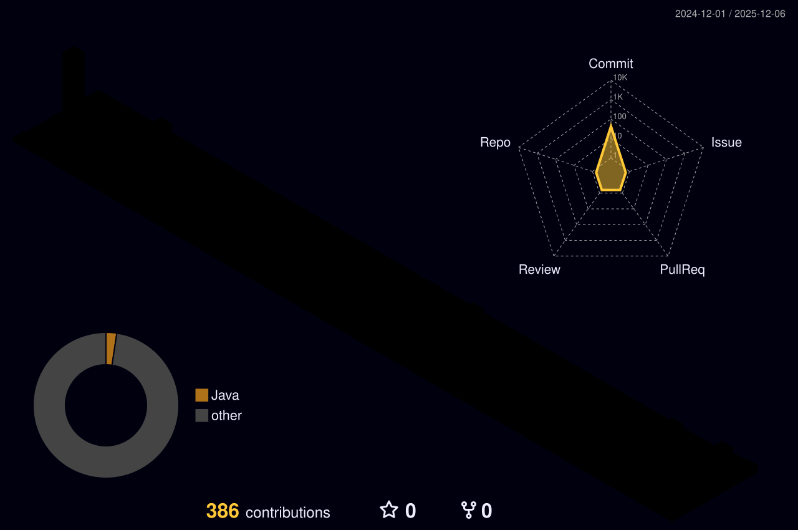

### 👋 Hey, I'm **Kim Daeyoung**
🎓 Master’s student in **AI Convergence Robotics** @ Inje Univ.  
💻 B.S. in **Computer Science**

---

---

  
  

---

---

<!--

  

--- 
-->

  

---

  
  

---

### ⚙️ Tech Stack  

  

---

### ✨ Little things
- 🤖 working on AI + robotics + vision  
- 🧠 like to make machines “see” better  
- 🛠 love building reproducible envs (docker, linux)

